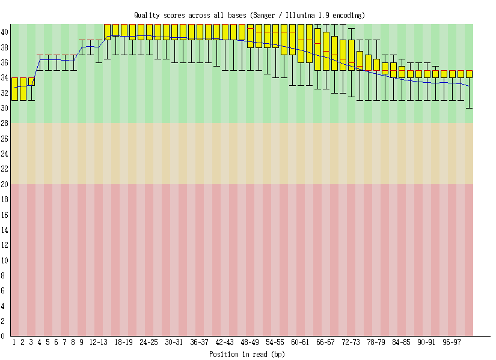

[](http://www.gnu.org/licenses/gpl-3.0)

# Quality control and Preprocessing of Sequencing Reads

This protocal was used for sequencing data quality control and preprocessing. We showed how to use common tools in quality control and preprocessing of sequencing reads.

The specific purposes of the dir system were showed as follows:

  __1. Input__: We store the partial raw input for user to test the sample data quickly without additional data downloading.  The data in input directory are incomplete, user can download the complete data in Data access.
  
  __2. Output__: The final output results of each tools in workflow.
  
  __3. Workflow__: Step by step pipeline. 
  
  __4. README.md__: In readme file, user can learn basic information for data access and tool usages.
  
 
  __5. graphs__: Figures in analysis.
  
  __6. LICENSE__: The copyright file.


## Workflow


## Data access

Here, we provide the sample data for quality control and preprocessing of sequencing reads, and the softwares used in pipeline were provided with their download links.
The complete smaple data can be accessed as follows:
[SRR2061397_1.fastq.gz](http://ftp.sra.ebi.ac.uk/vol1/fastq/SRR206/007/SRR2061397/SRR2061397_1.fastq.gz),
[SRR2061397_2.fastq.gz](http://ftp.sra.ebi.ac.uk/vol1/fastq/SRR206/007/SRR2061397/SRR2061397_2.fastq.gz), 
[SRR2061398_1.fastq.gz](http://ftp.sra.ebi.ac.uk/vol1/fastq/SRR206/008/SRR2061398/SRR2061398_1.fastq.gz), 
[SRR2061398_2.fastq.gz](http://ftp.sra.ebi.ac.uk/vol1/fastq/SRR206/008/SRR2061398/SRR2061398_2.fastq.gz). 

Those data are about Arabidopsis thaliana response to cytokinin in roots and shoots, which aims to identify genes which are differentially expressed in root and/or shoot material in response to exogenous cytokinin.pbaaims to identify genes which are differentially expressed in root and/or shoot material in response to exogenous cytokinin.

## Input Data

The example data used here is the paired-end fastq file generated by using Illumina platform.  

- R1 FASTQ file: `Input/SRR2061397_1.fastq`  
- R2 FASTQ file: `Input/SRR2061397_2.fastq`  

Each entry in a FASTQ files consists of 4 lines:  

1. A sequence identifier with information about the sequencing run and the cluster. The exact contents of this line vary by based on the BCL to FASTQ conversion software used.  
2. The sequence (the base calls; A, C, T, G and N).  
3. A separator, which is simply a plus (+) sign.  
4. The base call quality scores. These are Phred +33 encoded, using ASCII characters to represent the numerical quality scores.  

The first entry of the input data:
```
@SRR2061397.1 UNC10-SN254:519:H8PAHADXX:2:1101:1390:2053/1
ATTTTCTCATTCTCTCCTACAACAAGTTTCCGCCGCTAAGCCACTCACTACGCAGCCATGGCAAATCCTGACCATGTTTCAGATGTGCTACATAATTTGT
+
@@@FFDFFGD<FHHIGBGGGHGEGC9<ACF<@FHIFDGIEDG3?BBH=DHHHGE;BHFHCBDD>DECCC>>CC;(;@@CAACA>C@C>>;@ACA@CC:@:
```

## Prequisite softwares

The prequisite softwares can be obtained by visiting their released website. For example,
1. [__FastQC__](https://codeload.github.com/s-andrews/FastQC/zip/refs/heads/master)
2. [__iTools__](https://github.com/BGI-shenzhen/Reseqtools/blob/master/iTools_Code20180520.tar.gz)
3. [__Cutadapt__](https://codeload.github.com/jamescasbon/cutadapt/zip/refs/heads/master)
4. [__Fastp__](https://codeload.github.com/OpenGene/fastp/zip/refs/heads/master)
5. [__FASTX__](https://codeload.github.com/agordon/fastx_toolkit/zip/refs/heads/master)

User can install and use those softwares with linux-like system.

By integrating those softwares, we could finish the quality control and preprocessing for high-throughput data in multiple way. In addition, we provide the simple usage of those software for the users.

## Major steps

#### Step 1: running the FastQC to conduct quality checking

- Note that you have to normalize the path in the shell script.

```
sh Workflow/1_run_fastqc.sh
```

#### Step2: running the iTools to conduct quality checking alternatively

- Note that you have to normalize the path in the shell script.

```
sh Workflow/2_run_iTools.sh
```

#### Step3: running the Cutadapt to conduct read preprocessing (removing adapter)

```
sh Workflow/3_run_cutadapt.sh
```
#### Step4: run fastp to perform quality control, adapter trimming, quality filtering and per-read quality pruning

```
sh Workflow/4_run_fastp.sh fastp
```
#### Step 5: run fastx_clipper to remove adapter

```
sh Workflow/5_run_fastx_clipper.sh
```

## Expected result

Fastqc Result for SRR2061397_1 showed the distribution of quality score for each base:
Fastqc Result for SRR2061397_2 showed the distribution of quality score for each base:
Fastp Result for SRR2061397_1 showed the distribution of base content ratios across read:
Fastp Result for SRR2061397_2 showed the distribution of base content ratios across read:
iTools Result for SRR2061397_1 showed the basic information of reads, sucha read number, read length, GC content, and base content:
```
##SRR2061397_1.fastq##
#ReadNum: 25000	BaseNum: 2500000	ReadLeng: 100
#GC%: 44.71%	AT%: 55.29%
#A BaseNum: 692018	27.68%
#C BaseNum: 574981	23.00%
#T BaseNum: 690226	27.61%
#G BaseNum: 542734	21.71%
#N BaseNum: 41	0.00%

#BaseQ:0--10 : 23575(0.94%)	>Q10: 99.06%
#BaseQ:10--20 : 13795(0.55%)	>Q20: 98.51%
#BaseQ:20--30 : 75048(3.00%)	>Q30: 95.50%
#BaseQ:30--40 : 1471835(58.87%)	>Q40: 36.63%
#BaseQ:40--50 : 915747(36.63%)	>Q50: 0.00%

#ReadQ:0--10 : 22(0.09%)	>Q10: 99.91%
#ReadQ:10--20 : 205(0.82%)	>Q20: 99.09%
#ReadQ:20--30 : 795(3.18%)	>Q30: 95.91%
#ReadQ:30--40 : 23977(95.91%)	>Q40: 0.00%
#ReadQ:40--50 : 1(0.00%)	>Q50: 0.00%

##SRR2061397_2.fastq##
#ReadNum: 25000	BaseNum: 2500000	ReadLeng: 100
#GC%: 44.71%	AT%: 55.18%
#A BaseNum: 689144	27.57%
#C BaseNum: 569646	22.79%
#T BaseNum: 690456	27.62%
#G BaseNum: 548221	21.93%
#N BaseNum: 2533	0.10%

#BaseQ:0--10 : 75065(3.00%)	>Q10: 97.00%
#BaseQ:10--20 : 23194(0.93%)	>Q20: 96.07%
#BaseQ:20--30 : 105595(4.22%)	>Q30: 91.85%
#BaseQ:30--40 : 1456988(58.28%)	>Q40: 33.57%
#BaseQ:40--50 : 839158(33.57%)	>Q50: 0.00%

#ReadQ:0--10 : 365(1.46%)	>Q10: 98.54%
#ReadQ:10--20 : 465(1.86%)	>Q20: 96.68%
#ReadQ:20--30 : 1203(4.81%)	>Q30: 91.87%
#ReadQ:30--40 : 22967(91.87%)	>Q40: 0.00%

```
Cutadapt Result showed the summary of output:
```
===SRR2061397 Summary ===

Total read pairs processed:             25,000
  Read 1 with adapter:                      31 (0.1%)
  Read 2 with adapter:                      30 (0.1%)
Pairs that were too short:               1,038 (4.2%)
Pairs written (passing filters):        23,962 (95.8%)

Total basepairs processed:     5,000,000 bp
  Read 1:     2,500,000 bp
  Read 2:     2,500,000 bp
Quality-trimmed:                 222,267 bp (4.4%)
  Read 1:        67,386 bp
  Read 2:       154,881 bp
Total written (filtered):      4,700,683 bp (94.0%)
  Read 1:     2,365,705 bp
  Read 2:     2,334,978 bp
```
## License
It is a free and open source software, licensed under []() (choose a license from the suggested list:  [GPLv3](https://github.com/github/choosealicense.com/blob/gh-pages/_licenses/gpl-3.0.txt), [MIT](https://github.com/github/choosealicense.com/blob/gh-pages/LICENSE.md), or [CC BY 4.0](https://github.com/github/choosealicense.com/blob/gh-pages/_licenses/cc-by-4.0.txt)).
