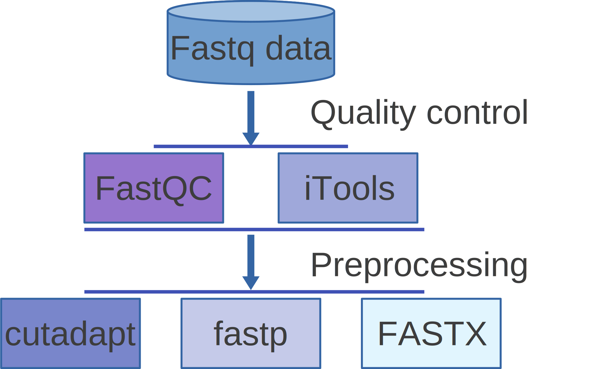

[](http://www.gnu.org/licenses/gpl-3.0)

# Quality control and Preprocessing of Sequencing Reads

This protocal was used for sequencing data quality control and preprocessing. We showed how to use common tools in quality control and preprocessing of sequencing reads.

The specific purposes of the dir system were showed as follows:

  __1. Input__: We store the partial raw input for user to test the sample data quickly without additional data downloading.  The data in input directory are incomplete, user can download the complete data in Data access.
  
  __2. Output__: The final output results of each tools in workflow.
  
  __3. Workflow__: Step by step pipeline. 
  
  __4. README.md__: In readme file, user can learn basic information for data access and tool usages.
  
  __5. LICENSE__: The copyright file.
  
  

## Workflow




## Data access

Here, we provide the sample data for quality control and preprocessing of sequencing reads, and the softwares used in pipeline were provided with their download links.
The complete smaple data can be accessed as follows:
[SRR2061397_1.fastq.gz](http://ftp.sra.ebi.ac.uk/vol1/fastq/SRR206/007/SRR2061397/SRR2061397_1.fastq.gz),
[SRR2061397_2.fastq.gz](http://ftp.sra.ebi.ac.uk/vol1/fastq/SRR206/007/SRR2061397/SRR2061397_2.fastq.gz), 
[SRR2061398_1.fastq.gz](http://ftp.sra.ebi.ac.uk/vol1/fastq/SRR206/008/SRR2061398/SRR2061398_1.fastq.gz), 
[SRR2061398_2.fastq.gz](http://ftp.sra.ebi.ac.uk/vol1/fastq/SRR206/008/SRR2061398/SRR2061398_2.fastq.gz). 

Those data are about Arabidopsis thaliana response to cytokinin in roots and shoots, which aims to identify genes which are differentially expressed in root and/or shoot material in response to exogenous cytokinin.pbaaims to identify genes which are differentially expressed in root and/or shoot material in response to exogenous cytokinin

## Prequisite softwares

The prequisite softwares can be obtained by visiting their released website. For example,
1. [__FastQC__](https://codeload.github.com/s-andrews/FastQC/zip/refs/heads/master)
2. [__iTools__](https://github.com/BGI-shenzhen/Reseqtools/blob/master/iTools_Code20180520.tar.gz)
3. [__Cutadapt__](https://codeload.github.com/jamescasbon/cutadapt/zip/refs/heads/master)
4. [__Fastp__](https://codeload.github.com/OpenGene/fastp/zip/refs/heads/master)
5. [__FASTX__](https://codeload.github.com/agordon/fastx_toolkit/zip/refs/heads/master)
6. 
User can install and use those softwares with linux-like system.

By integrating those softwares, we could finish the quality control and preprocessing for high-throughput data in multiple way. In addition, we provide the simple usage of those software for the users.

## Major steps

#### Step 1: running the FastQC to conduct quality checking
FastQC can be either as an interactive  graphical application. Alternatively, you can run the program in non-interactive way. If you don't specific any files to process, the program will try to open the interactive application. Click the file button and choose fastq files located in your computer. Click the confirm button, and wait your reports about several minutes. Run fastqc from the command line like this:

```
sh Workflow/1_run_fastqc.sh
```

Parameter description: -t for CPU number, -o for output directory

iTools is a toolkit for analyzing next-generation sequencing data. One module of iTools is Fqtools, which processes the fastq sequence file. Here, we show one of its function as follows: summarizes the quality and amount of data as well as the GC content. Run iTools from the command line like this:

```
iTools Fqtools stat -InFq SRR2061397_1.fastq -InFq SRR2061397_1.fastq -InFq SRR2061398_1.fastq -InFq SRR2061397_2.fastq -OutStat read.info -CPU 8
```

Parameter description: -InFq for input file, -OutStat for the output file, -CPU: CPU number 

Cutadapt searches for the adapter in all reads and removes it when it finds is. The command-line for cutadapt is:

```
cutadapt -a AGATCGGAAGAGC -A AGATCGGAAGAGC -q 30 -m 20 –trim-n -O 10 -o SRR2061397_1trimmed.fastq -p SRR2061397_2trimmed.fasq  SRR2061397_1.fastq SRR2061397_2.fastq
```

Parameter description: -a for sequence of an adapter ligated to the 3’ end, -A 3’ adapter to be removed from second read in a pair, -q trim low-quality bases from 5’ and 3’ ends of each read. -m 20 for discard trimmed reads that are shorter than 20. -O MINLENGTH if the overlap between the read and the adapter is shorter than MINLENGTH, the read is not modified, reduces the number of bases trimmed due to random adapter match. -o output file -p paired-output.

fastp can perfom quality control, adapter trimming, quality filtering, per-read quality pruning with a single scan of fastq data. The command-line for fastp is:

```
fastp -i SRR2061397_1.fastq -I SRR2061397_2.fastq -o SRR2061397_1clean.fastq -O SRR2061397_2clean.fastq
```

Parameter description: -i read1 input file, -I read2_inputfile, -o read1 output file, -O read2_output file.

Different tools in FASTX-Toolkit perform a list of preprocessing tasks, such as, convert fastq files to fasta files, removing sequencing adapters, filters sequences based on quality, shortening reads, trims sequences based on quality.Here, one tool as example is showed as follows:

```
fastx_clipper -a AGATCGGAAGAGC -l 25 -d 0 -Q 33 -i SRR2061397_1.fastq -o SRR2061397_1trimmed.fastq
```
Parameter: -a for adapter string, -l for discard sequence shorter than N nucleotides. -d N keep the adapter and N bases after it. -i input file, -o output file.

## License
It is a free and open source software, licensed under []() (choose a license from the suggested list:  [GPLv3](https://github.com/github/choosealicense.com/blob/gh-pages/_licenses/gpl-3.0.txt), [MIT](https://github.com/github/choosealicense.com/blob/gh-pages/LICENSE.md), or [CC BY 4.0](https://github.com/github/choosealicense.com/blob/gh-pages/_licenses/cc-by-4.0.txt)).
